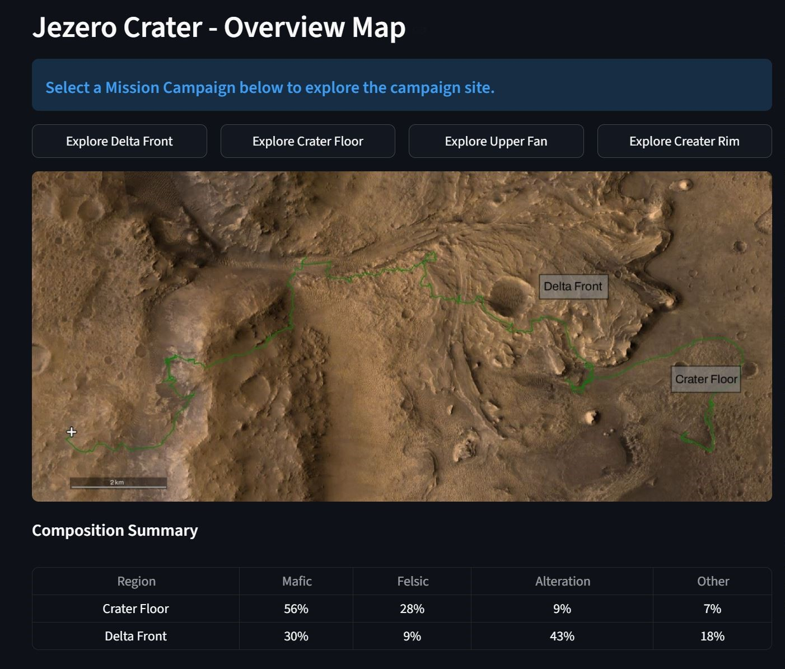
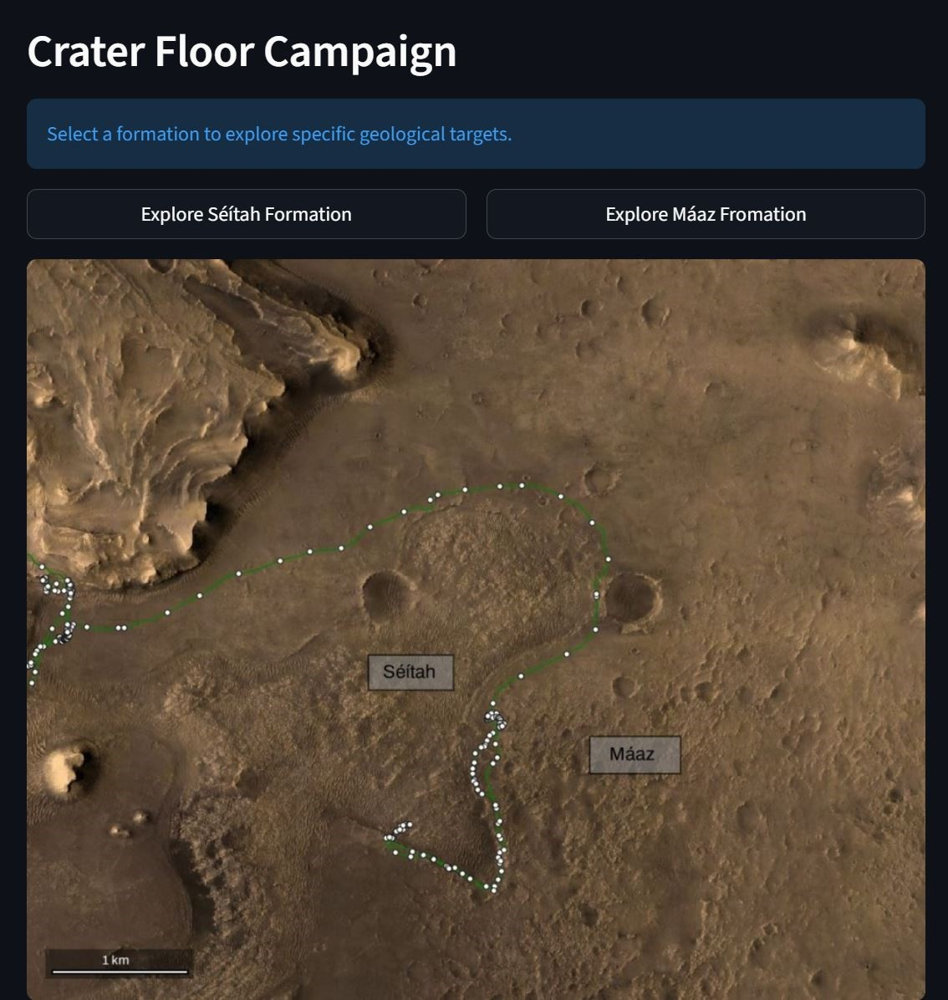
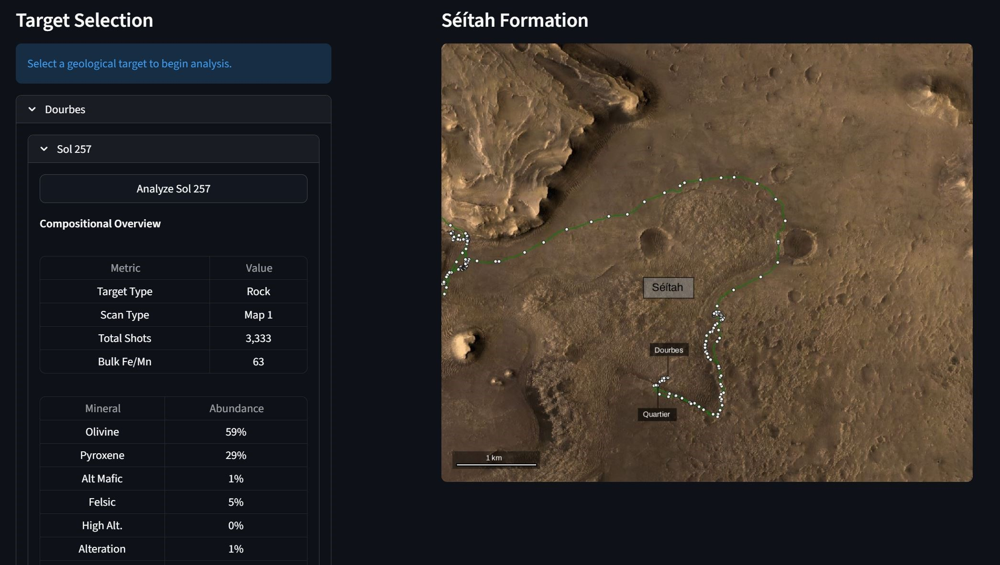
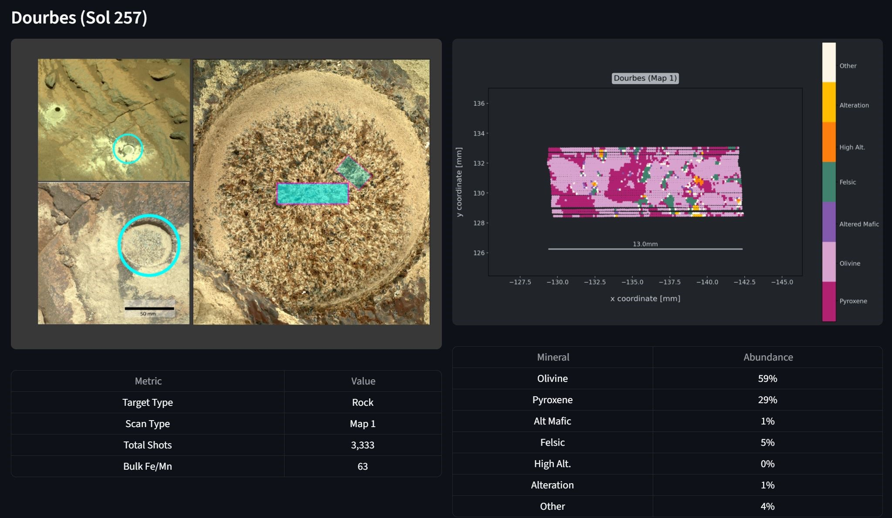
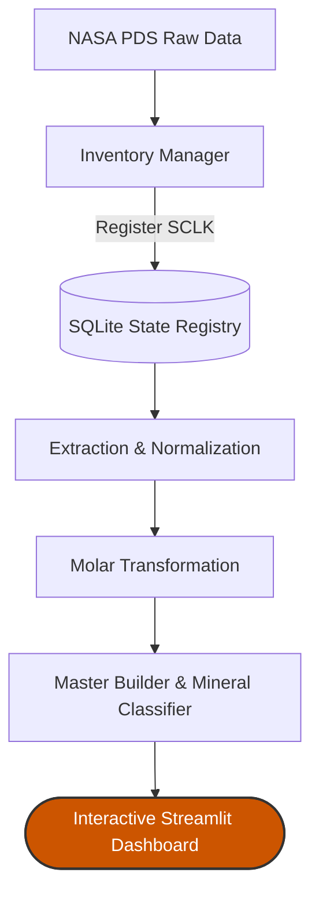

# PIXL Data Processing Pipeline
### [🚀 View Live Dashboard](https://mars2020-mineral-classifier.streamlit.app/)
*(Note: If the app is "asleep," simply click **"Wake up"** — it will be ready in about 30 seconds.)*

**Engineering a Scalable Data Pipeline: Processing 40,000+ NASA Mars Perseverance Scans with 1:1 Scientific Parity.**

<p align="center">
  
</p>

---

## Core Porject Impact & Engineering Highlights 
* **Performance Optimization**: Automated processing of **40,000+ high-dimensional geochemical scans**.
* **State Management**: Implemented a **SQLite-driven state machine** to track thousands of scans across disparate Martian sols, ensuring **99.9% data integrity** and **preventing redundant processing**.  
* **Scientific Parity**: Developed the "MIP_SF" stoichiometric classification algorithm, achieving **1:1 correlation** with NASA's internal MIST algorithm for primary igneous mineral detection. 

---

## 🛠️ Technical Stack


---

## 🖥️ Live Research Dashboard & User Interface
The project deploys a full-stack research environment that enables interaction with rover telemetry in real-time. By transitioning NASA’s static PDS files into a dynamic Streamlit interface, the platform provides immediate spatial context for chemical data.

### 1. Mission Context & Campaign Selection
The dashboard provides a high-level overview of the Jezero Crater, allowing users to drill down into specific mission campaigns such as the **Crater Floor** or **Delta Front**. 

<p align="center">
  
</p>

<p align="center">
  
</p>


### 2. Interactive Target Selection
Users can select specific geological targets (e.g., "Dourbes" or "Quartier") and specific scans by Sol. The interface dynamically pulls compositional metrics, such as Bulk Fe/Mn ratios and primary mineral abundances, from each scan's JSON files.
<p align="center">
  
</p>

### 3. High-Resolution Geochemical Mapping
The core impact of the **MIP_SF algorithm** is visualized through 2D spatial maps. These generate shot-by-shot mineralogical classifications, achieving parity with NASA's internal MIST algorithm.
<p align="center">
  
</p>

---

## 📊 Pipeline Architecture
The pipeline follows a modular five-stage architecture governed by a central database registry:


## Modular Component Breakdown
The five-stage architecture is governed by a central database registry: 
1. <b>Inventory & Discovery</b> (`inventory_manager.py`): Scans raw data directories to identify unique Spacecreaft Clock (SCLK) identifiers and registers them into the SQLite database.
2. <b>Extraction & Parsing</b> (`parsers.py`): Isolate spatial coordinates, engineering telemetry (detector livetimes, temperature, etc.) and normalizing raw specta counts per second (CPS).
3. <b>Chemical Transformation</b> (`molar_transform.py`): Maps elemental weight percentages to molar abundances and calculates key geological ratios (e.g., Fe/Mn, Mafic Index, etc.)
4. <b>Master Synthesis</b> (`master_builder.py`): Merges coordinates, telemetry, and chemistry into a unified "Geochem Mater" dataset. 
5. <b>Mineral Classification</b> (`mineral_classifier.py`): Uses the synthesized datasets to classify "shot-by-shot" mineralogy and generates spatial mapping assets.

---

## 📂 Directory Structure
To maintain relative pathing and cross-platform compatability, the environment is organized as follows: 

```
Mars2020-Mineral-Classifier/
├── .devcontainer/              # Automated environment configuration
├── .streamlit/                 # UI configuration (Dark Mode toggle)
├── docs-assets/		# README screenshots
├── data/
    └── raw/                    # Original NASA PDS/PIQUANT .csv files
        └── spectra/            # NASA raw 'rfs' files (.csv)
        └── abundances/         # NASA processed 'rqa/rqb/rqc' files (.csv)
    └── processed/              # All split, transformed, and generated files
    └── analysis/               # JSON and mapping.csv files used to generate maps
├── refs/                       # Reference molar masses and n-ratios
├── src/                        # Core engineering logic
    └── assets/                 # Visual assets for navigation and mapping
    └── inventory_manager.py    # Directory scanning and database updates
    └── mapping_tools.py        # 2D spatial visualization and labeling
    └── master_builder.py       # Table merging and geochemical rule application
    └── mineral_classifier.py   # Stoichiometric classification and report generation
    └── molar_transform.py      # Weight % to molar abundance conversion
    └──	navigation_app.py	# Interactive mission context app
    └── parsers.py              # NASA 'rfs' files extraction and normalization
    └──seed_mineral_rules.py    # Mineralogy classification rulesets
├── .gitattributes              # Language classification and path handling
├── PIXL_pipeline_registry.db   # Central SQLite state management
├── README.md                   # Project documentation
└── requirements.txt            # Environment dependencies
```

---

## 🔄 Data Flow & Registry Logic
The pipeline utlizes a "Pull" logic governed by `PIXL_pipeline_registry.db`. This acts as the single source of truth, tracking every SCLK ID through for primary tables: `file_inventory`, `processing_status`, `sample_registry`, `mineral_rules`.

#### Processign Pattern:
- <b>Query</b>: Each script asks the database for files where prerequisite flags are met but its own stage is incomplete.
- <b>Process</b>: Excecutes vectorized operations (Pandas/NumPy) for high-speed calculations. 
- <b>Register</b>: Updates the registry with new file paths and flips the status flag to `1`. 

This architecture ensures that if a script crashes or a file is missing, the pipeline simply skips that entry and continues, rather than failing the entire batch.

---

## Technical Environment 
The pipeline is designed to be cross-platform, using standard Python libraries to marge complex file structures and data transformations. 

- File I/O Pathing (`os`, `glob`): We use `os` for robust relative pathing. `glob` is used to match patterns to identify specific NASA file types (`rfs`, `rqa`, etc.) within nested directories. 
- Data Manipulation (`pandas`, `numpy`): Geochemical calculations, normalizations and molar mass conversions are handled using vectorized operations for speed and precision. 
- State Management (`sqlite3`): A local database acts a single source of truth, tracking every Spacecraft Clock (SCLK) ID and its current processing stage

---

## 📖 PIXL Data Glossary
The NASA Planetary Data System (PDS) uses specific three-letter suffixes to distinguish between raw telemetry, processed chemistry, and bulk averages. This project uses the Spacecraft Clock (SCLK)—the 10-digit code in the filename—to link these disparate files together.

files from the [PDS Geosciences website](https://pds-geosciences.wustl.edu/m2020/urn-nasa-pds-mars2020_pixl/).


| Suffix | Name | Purpose in this Pipeline |
| :--- | :--- | :--- |
| **.rfs** | Raw Formatted Spectrum | Source of Spatial and PMC coordinates (x, y, z). |
| **.rqa/b** | Reduced Quantitative Analysis (Det A/DetB) | Processed weight percentages (wt%) used for high-resolution mineral mappings. |
| **.rqc** | Combined Analysis (A+B) | Primary Data Source for final mineral maps. |

## 🎓 Research & Academic Context
This pipeline was developed to characterize the elemental and mineralogical composition of the Jezero Crater using PIXL XRF scans. By bridging complex radiation theory with automated data engineering, it facilitates the transition from static raw telemetry to dynamic, interactive research environments.
[Read Full MSc Thesis](https://atrium.lib.uoguelph.ca/server/api/core/bitstreams/8dd984d7-c84b-4457-b635-f81fc8d1d5f9/content).